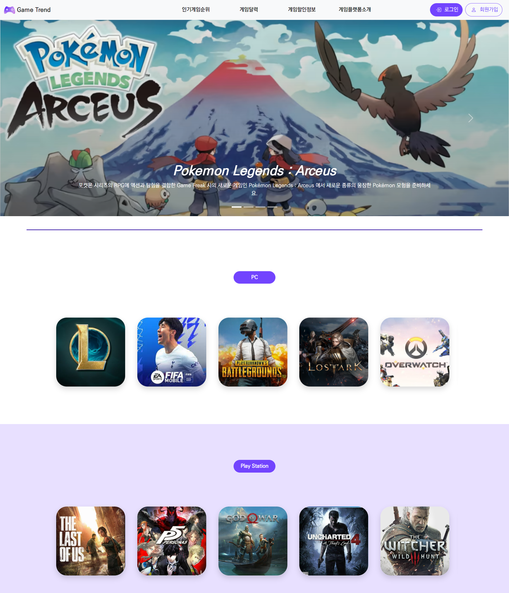
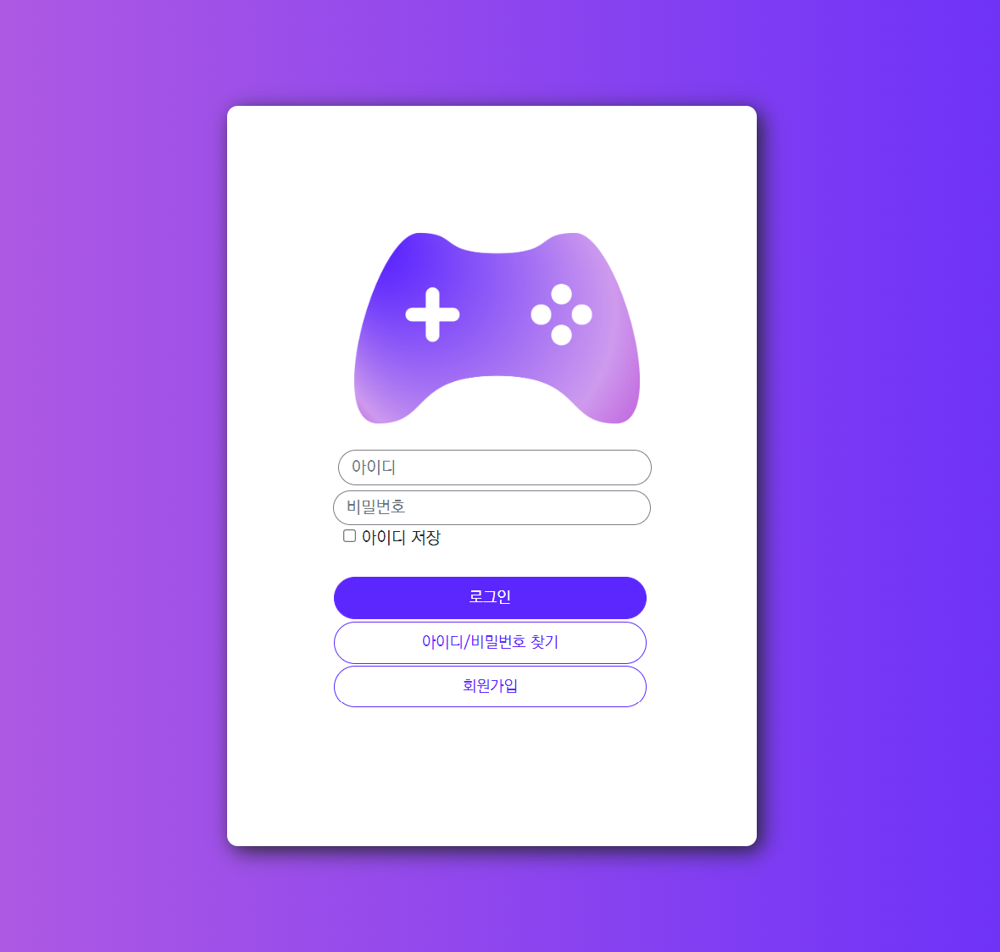
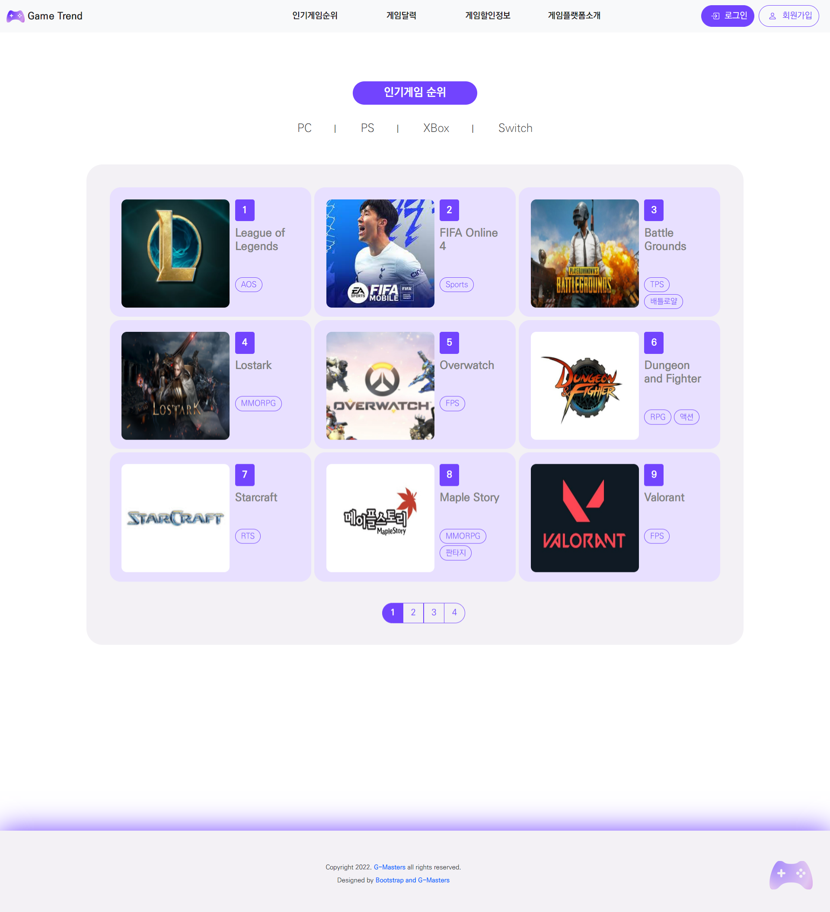
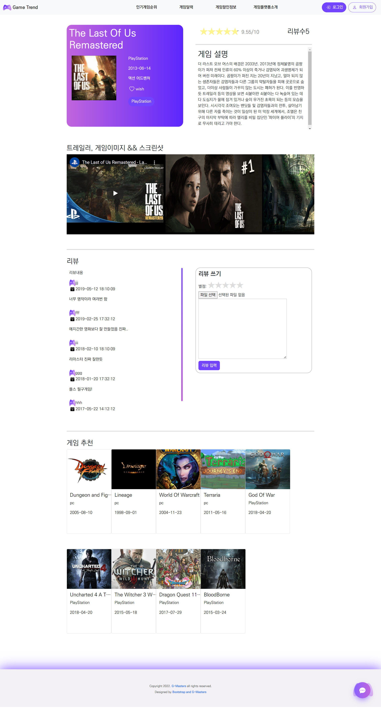

 

# 콘솔 게임 랭킹 및 정보 제공 웹 서비스

### 프로젝트 개발 기간

`2022.05.04.` - `2022.05.23.` (3주)

 

# 📌 기술 스택

### Back-End

  
  
  

### Front-End

   
   
  
   

### VCS

  
  
  

### Project Management Tool

  
  

 

# 📌 프로젝트 배경

- 콘솔 게임 랭킹을 알려주는 해외 사이트는 많지만 국내 사이트가 없다.
- 국내 게임계의 관심 환기 및 확대를 목표로 한다.

 

# 📌 프로젝트 개요

### 게임 순위 및 정보 제공

- 플랫폼 별로 인기있는 콘솔 게임의 순위와 정보를 제공
- 페이징 처리
- 구매 인증을 통한 리뷰에 따라 게임 순위가 변경
- 게임 세부 정보 제공 및 리뷰, 별점, 추천
- 연도별 각각의 플랫폼 베스트 게임 정보 제공
- 게임 출시 정보 제공
- 게임 할인 정보 제공

### 챗봇을 이용한 게임 추천

- 장르별 게임 추천
- 플랫폼별 게임 추천

### 마이 페이지

- 위시 리스트
- 나의 리뷰

### 관리자 페이지

- 게임 정보 CRUD
- 메인 페이지 carousel 이미지 설정
- 구매 인증 및 리뷰 관리

 

# 📌 서비스 화면

### 메인

### 로그인

### 인기 게임 순위

### 세부 정보

### 연도별 게임 정보

### 플랫폼별 게임 정보

### 장르별 / 플랫폼별 게임 추천

### 나의 리뷰

### 게임 관련 정보 제공

### 관리자

 

# 📌 프로젝트 산출물

### ERD

### 화면 흐름도

### 기능

 

# 📌 기대효과

- 국내 게임 업계에 대한 관심 증진
- PC가 상당 부분 점유하던 기존의 국내 게임 시장에서 콘솔 게임기 플랫폼의 성장에 도움

 

# 📌 팀원 소개

| 이종무                                                              | 김정규                                                          | 연주원                                                            | 이새하                                                            | 이훈학                                                            |
| ------------------------------------------------------------------- | --------------------------------------------------------------- | ----------------------------------------------------------------- | ----------------------------------------------------------------- | ----------------------------------------------------------------- |
|    |  |  |  |  |
| [JaeHa29](https://github.com/JaeHa29)                               | [inacro](https://github.com/inacro)                             | [joo1yeon](https://github.com/joo1yeon)                           | [saehalee](https://github.com/saehalee)                           | [hoonak2](https://github.com/hoonak2)                             |
| 팀장  DB 데이터 구축  게임 정보 제공 기능  문서화  발표 |  상세 정보(리뷰, 추천, 별점) 제공 기능                       |  관리자 기능 (게임 등록, 구매 인증)  마이페이지             | PM  DB 모델링  랭킹 기능  챗봇                           |  회원 관리  이메일 인증                                     |

 

---

<b>Game Trend 팀 활동</b> | [Trello](https://trello.com/b/h83y2C8Y/game-trend)
